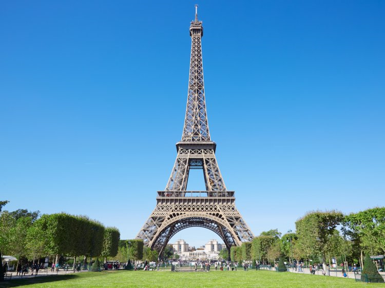
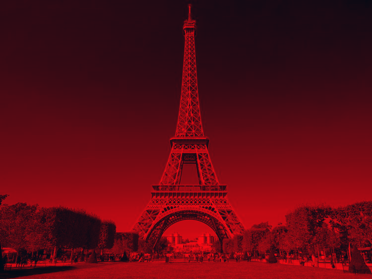
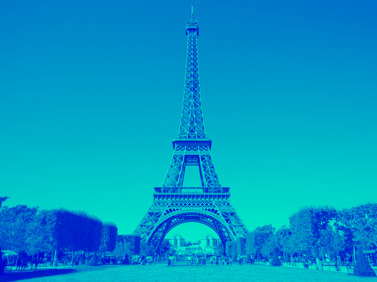

# Color editor for images in (*.bmp) format.

## Table of contents
* [General info](#general-info)
* [Technologies](#technologies)
* [Program operation examples](#examples-of-program-effects)
* [Status](#status)

## General info
This simple program was written for one of the 'Programming 2' (pl: 'Programowanie 2') exercises at the Jagiellonian University.
Its task is to change the color intensity, set by the user for a given picture in *.bmp format. You can change three colors: blue, green, red; each of them can be set within the range [0, 255]. If you set any of them to value '-1', the color value in the image does not change. Based on the image (the name of which is given by the user), the program creates a new one image (by default named 'new.bmp'), with new color settings.

## Technologies
The program was written completely in C language.

## Examples of program effects

### Original photo:


#### Ex. 1
```meanwhile
   // input
   
    BLUE (0-255): 100
    GREEN (0-255): -1
    RED (0-255): -1

    OK, now enter the exact file name of the photo: 
    Eiffel.bmp
```

###### Result (file 'new.bmp'):
  
  
  
#### Ex. 2
```meanwhile
   // input
   
    BLUE (0-255): 200
    GREEN (0-255): -1
    RED (0-255): 0

    OK, now enter the exact file name of the photo: 
    Eiffel.bmp
```

###### Result:
  


## Status
The project has been completed. All assumptions and tasks have been completed.
